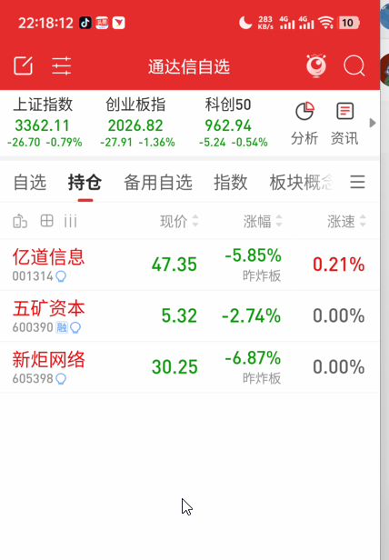

+++
title = "2025-06-19 吐出所有盈利"
description = "这是一个副标题"
date = "2025-06-20T02:47:04+08:00"
categories = [
	"复盘"
]
image = ""
+++

## 复盘

**比依股份**

昨日清仓.

昨日封单非常少, 尾盘清仓, 今日依然保持强势股该有的姿态, 高开后, 冲击涨停回落水下.

**亿道信息**

清仓.

跟随比依股份买入, 保持后排股的特性, 强势行情跟着喝汤, 行情走弱优先大跳水.

**新炬网络**

继续持仓, 密切关注60分钟缺口是否有效支撑.

英伟达相关AI数据中心, 昨日冲高回落搏涨停入手, 实际最后依然下行, 今日低开后说明走弱理应开盘出逃. 

**五矿资本**

继续持仓, 密切关注15分钟金叉能否突破20日均线, 否则走弱清仓.

## 新股观察

### 微信短剧

短期主线, 微信推出短剧小程序, 主打免费观看. 预期短剧腾讯合作商, 广告商等收益.

**百纳千成(300291)**: 北京+游戏+短剧+合作腾讯（来自韭研公社APP）

**慈文传媒**: 北京+游戏+短剧+合作腾讯（来自韭研公社APP）

**实益达**：炒作过微信广告商的连板老龙（来自韭研公社APP）

### AI机器人

长期主线

**亿嘉和**: 华为 + 养老机器人 + AI具身智能

**盛视科技**: 人形机器人研发取得重要. 业绩大增可期，叠加公司近期说得积极并购预期：通过投资、收购等方式重点布局具身智能机器人、AI大模型、AI智能体、AI芯片、AI算力等领（来自韭研公社APP）

### 京东进军线下医药连锁

JD还有传闻将进军整合重塑线下医药连锁（来自韭研公社APP）

**老百姓**：关注JD绯闻对象, 新成立药简单科技公司 经营范围包含数字技术服务业务；个人互联网直播服务等（来自韭研公社APP）

## 盘后心得

1.每日复盘, 盯盘关注大盘走势.

2.非强势题材只做龙头, 强势题材只做前排, 买不到就等.

3.使用缠论分析观察股, 中枢参考对应周期的BOLL.
