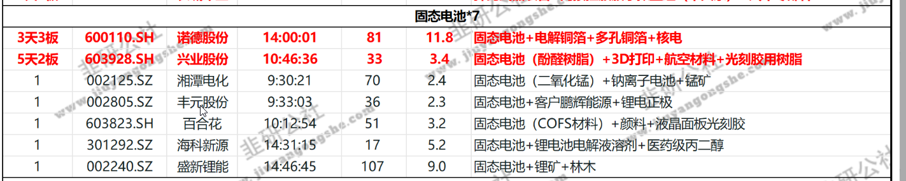

+++
date = '2025-06-22T13:23:16+08:00'
description = "误判题材, 做跟随, 勿猜测走势"
title = '2025-06-22 周复盘'
categories = [
	"股票"
]
tags = [
	"复盘"
]
image = ""
+++

## 复盘

**上证指数**

目前仍处于日线一笔下跌中, 30分钟未发生底背离.
下方支撑3340.

**新炬网络**

止损清仓

**五矿资本**

止损清仓

**慈文传媒**

建仓两次，冲高回落被套。

建仓原因是预期腾讯短剧题材爆发，冲高回落建仓，再下跌再建仓，收盘再下跌。

**复盘**：
1.开盘腾讯短剧相关股均弱势，百纳千成低开，冲高后迅速下跌，慈文传媒高开冲击涨停后迅速回落。此时**应该警觉百纳千成的走弱，不应该建仓。**  
2.观察股票前，应技术分析其形态，计算盈亏比，慈文传媒其实已经处在高位，此时应**警惕利好出货**。

**计划**：下周一观察**30分钟跌破中轨或能否冲击上轨止损。**

**兴业股份**

建仓，最终涨停。

前一日固态电池题材强势，判断兴业股份为龙二。开盘湘潭电化一字板，诺德股份高开6个点迅速涨停，兴业股份强度高于丰元股份，于是6个点建仓。

**复盘**：
1.龙一诺德股份有进仓机会，应该入诺德股份。  
2.对于龙头强势股，或者题材非常强时，挂6个点建仓，否则，优化操作为1分钟KDJ小于20时建仓。

**计划**：下周一密切关注开盘强度，最好向诺德股份调仓。
